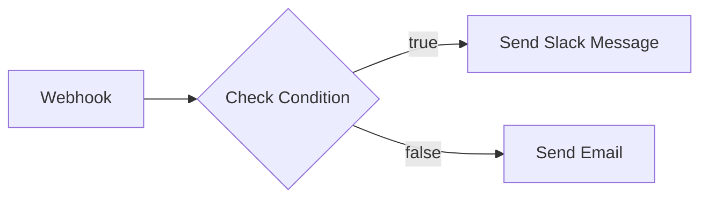

# n8n Overview

List and inspect workflows, executions, and credentials on your n8n instance at `{{N8N_DOMAIN}}`.

## Commands

### List Workflows (default)
```
n8n API → GET /workflows?limit=100
```

Present as a **datatable** with columns:
- Name
- Active (boolean)
- Updated At (date)
- Tags
- ID

### Filter Workflows
- Active only: `GET /workflows?active=true`
- By tag: `GET /workflows?tags=production`
- By name: `GET /workflows?name=keyword`

### Inspect a Workflow
When the user wants details on a specific workflow:
```
n8n API → GET /workflows/{id}
```

Show:
- Name and description
- Active status
- Node list with types and connections
- A mermaid diagram of the workflow flow
- URL: `https://{{N8N_DOMAIN}}/workflow/{id}`

### Recent Executions
```
n8n API → GET /executions?limit=20
```

Present as a datatable:
- Workflow Name
- Status (badge: success/error/waiting)
- Started At
- Finished At
- Mode (manual/trigger/webhook)

### Credentials
```
n8n API → GET /credentials
```

List available credentials (names and types only — secrets are never exposed).

## Visualization

When inspecting a workflow, generate a **mermaid flowchart** showing the node connections:



Use node names from the workflow and indicate branch conditions where applicable.
